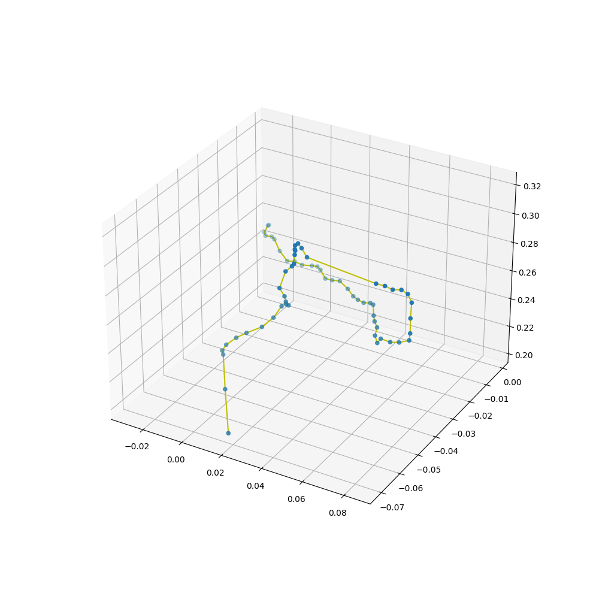

# ManojKolpeThesis - Depth estimation using multi view stereo 
Depth estimation is a crucial step towards inferring scene geometry from 2D images. The goal in monocular depth estimation is to predict the depth value of each pixel or inferring depth information, given only a RGB images as input.

  

Figure 1.0 Pretrained model  [[Link](https://aaltoml.github.io/GP-MVS/)] result on the test data

  

Courtesy: [Link](https://www.google.com/url?sa=i&url=https%3A%2F%2Fwww.mdpi.com%2F1424-8220%2F21%2F1%2F54&psig=AOvVaw1Z_IIELQkBeOsCJuiD2j8k&ust=1643441741590000&source=images&cd=vfe&ved=0CAwQjhxqFwoTCODUq_Wt0_UCFQAAAAAdAAAAABAO)

  

Courtesy: [Link](https://www.google.com/url?sa=i&url=https%3A%2F%2Ftowardsdatascience.com%2Fself-supervised-depth-estimation-breaking-down-the-ideas-f212e4f05ffa&psig=AOvVaw3va8tQsBacFhanuNSUk6Dk&ust=1643439567895000&source=images&cd=vfe&ved=0CAwQjhxqFwoTCPC8ueql0_UCFQAAAAAdAAAAABA2)

Model output on the generated test data

Original 

  

Predicted

  

Plotting of translation and quaterions (rotation matrix) extracted from the android phone

  

  

  

References

Android

[1] https://github.com/PyojinKim/ARCore-Data-Logger

[2] https://ksimek.github.io/2012/08/22/extrinsic/

[3] https://automaticaddison.com/how-to-convert-a-quaternion-to-a-rotation-matrix/

[4] https://www.youtube.com/watch?v=zjMuIxRvygQ

[5] https://www.youtube.com/watch?v=lVjFhNv2N8o&list=PLYm0s3jier_Se9_HKG1X6rQrKFxYo8x2-&index=22

[6] https://eater.net/quaternions

