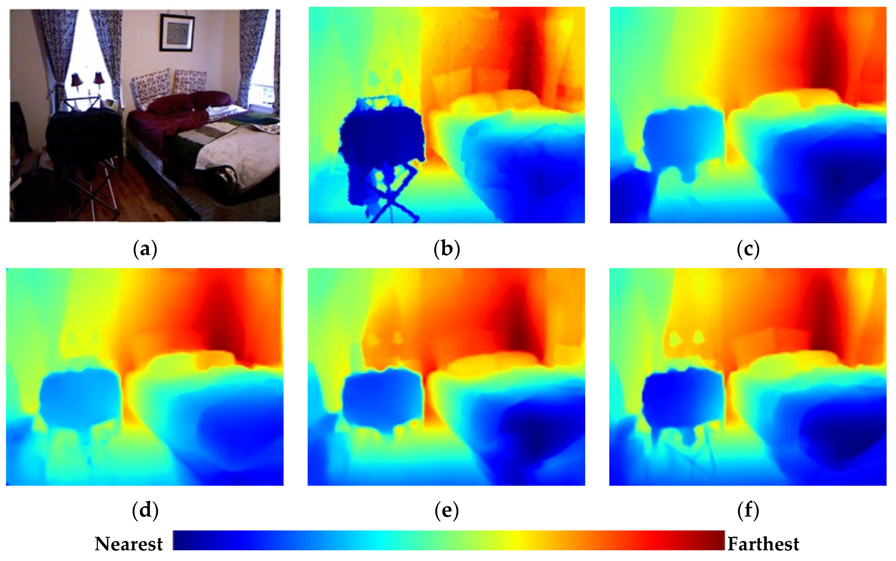

## Glossary

1. Depth estimation - Depth estimation is a crucial step towards inferring scene geometry from 2D images. The goal in monocular depth estimation is to predict the depth value of each pixel or inferring depth information, given only a single RGB image as input.
   
   Courtesy: [Link](https://www.google.com/url?sa=i&url=https%3A%2F%2Fwww.mdpi.com%2F1424-8220%2F21%2F1%2F54&psig=AOvVaw1Z_IIELQkBeOsCJuiD2j8k&ust=1643441741590000&source=images&cd=vfe&ved=0CAwQjhxqFwoTCODUq_Wt0_UCFQAAAAAdAAAAABAO) 
   
   Courtesy: [Link](https://www.google.com/url?sa=i&url=https%3A%2F%2Ftowardsdatascience.com%2Fself-supervised-depth-estimation-breaking-down-the-ideas-f212e4f05ffa&psig=AOvVaw3va8tQsBacFhanuNSUk6Dk&ust=1643439567895000&source=images&cd=vfe&ved=0CAwQjhxqFwoTCPC8ueql0_UCFQAAAAAdAAAAABA2)
   
2. Latent space encoding - Compressed representation of data
   Courtesy: [Link](https://miro.medium.com/max/700/0*kHJ_LsPi-jz_CreZ.png)
   
3. Encoder - Maps (sensory) input data to a different (often lower dimensional, compressed) feature representation.
4. Decoder - Maps the feature representation back into the input data space.
5. Disparity - A great difference.
6. Disparity estimation -
   [Disparity calculation](https://robotacademy.net.au/lesson/computing-disparity/)

   [Opencv version](https://opencv24-python-tutorials.readthedocs.io/en/latest/py_tutorials/py_calib3d/py_depthmap/py_depthmap.html)
   Stereo matching or disparity estimation is the process of finding the pixels in the multiscopic views that correspond to the same 3D point in the scene.
   
   
   disparity_horizontal = 1261 - 1140 = 121 pixels 
   disparity_vertical =  1378 - 1410 = 32 pixels
7. Gaussian process - In probability theory and statistics, a Gaussian process is a stochastic process (a collection of random variables indexed by time or space), such that every finite collection of those random variables has a multivariate normal distribution, i.e. every finite linear combination of them is normally distributed.
   
8. Multi view stereo (MVS) - Instead of capturing two photographs from two different viewpoints in case of two-view case, multi-view stereo would capture more viewpoints in-between to increase robustness, e.g. to image noise or surface texture.
   
9. Camera Poses - Position of camera with respect to the world coordinate.
10. Internal parameter of the camera - The intrinsic parameters represent the optical center and focal length of the camera.
    
    
11. Monocular - A monocular is a compact refracting telescope used to magnify images of distant objects, typically using an optical prism to ensure an erect image, instead of using relay lenses like most telescopic sights.
12. Monocular video camera - A monocular camera is a common type of vision sensor used in automated driving applications. When mounted on an ego vehicle, this camera can detect objects, detect lane boundaries, and track objects through a scene.
13. Rig - a device or piece of equipment designed for a particular purpose.
14. Perception - The ability to see, hear, or become aware of something through the senses.
15. Simultaneous localization and mapping (SLAM) - Simultaneous localization and mapping (SLAM) is the computational problem of constructing or updating a map of an unknown environment while simultaneously keeping track of an agent's location within it.
16. Autonomous machines - An autonomous robot is a robot that acts without recourse to human control.
17. Visual-inertial odometry techniques - Visual-Inertial odometry (VIO) is the process of estimating the state (pose and velocity) of an agent.
18. Inertial measurement unit (IMU) - An inertial measurement unit (IMU) is an electronic device that measures and reports a body's specific force, angular rate, and sometimes the orientation of the body, using a combination of accelerometers, gyroscopes, and sometimes magnetometers.
    [Link](https://www.sparkfun.com/products/13284)
19. ARCore - ARCore, also known as Google Play Services for AR, is a software development kit developed by Google that allows for augmented reality applications to be built.
- Platform - Android, Unity, IOS, Unreal
- 
  [Augmented Reality](https://developers.google.com/ar)
20. ARKit - Place 3D objects in the real world using AR Quick Look, powered by ARKit. AR Quick Look also supports models and scenes created in Reality Composer, so you can easily create interactive experiences to be shared and viewed on iPhone and iPad.
    [Augmented Reality in ios](https://developer.apple.com/augmented-reality/)
21. Plane-sweep cost volume input - 
22. Bottleneck - 
23. Pose-kernel structure - 
24. Latenet representation - 
25. 

