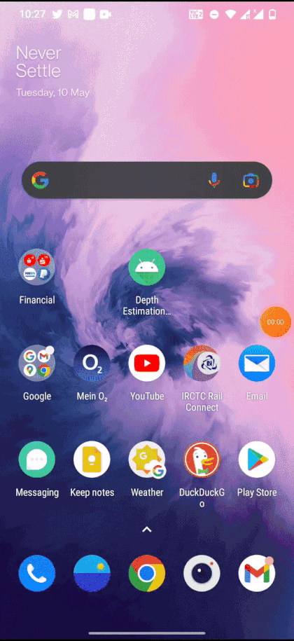

# GPMVS deployment on the android device

Major chunk of the deep learning based depth estimation using gaussian multiview stereo code is present in the python language. The official language of Android is Kotlin. While android apps can also be developed with different programming languages. Such as Java, C++, C#, Python,Dart. However, Android doesn't support native Python development. 
Either all the code in the python needs to be converted into java/kotlin or python code is embedded into the java/kotlin script performing specific functions.

There are different methods to embedd the python components on the android.
Some of them are listed below.

* Chaquopy [1,2,3] 
  Chaquopy include Python components in an Android app, along with the following features  
  - Full integration with Android Studio’s standard Gradle build system. [2]
  - Simple APIs for calling Python code from Java/Kotlin, and vice versa. [2]
  - A wide range of third-party Python packages, including SciPy, OpenCV, TensorFlow and many more. [2]

* Kivy [4]  
  Open source Python library for rapid development of applications that make use of innovative user interfaces, such as multi-touch apps.

* Beeware [5]  
  Native support for python and deployment in the iOS, Android, Windows, MacOS, Linux, Web, and tvOS.

The depth estimation app is developed with the help of Chaquopy and deployed in the android device. 
The main activity code of the android is written in Kotlin and the deep learning based depth estiamtion is implemented using Chaquopy. 

The depth estimation algorithm takes three arguments to estimate the depth. Pair of images, corresponding poses (extrinsic homogeneous matrix) and intrinsic matrix of the camera. 

Pair of images are captured by the android device and corresponding inertial odometry readings (Poses of camera) can be extrcated using ARKit framework. The intrinsic camera matrix can be constructed by finding the cameras focal length and using the following formula.

Dependency

```
import android.media.Image;

import com.google.ar.core.Frame;
import com.google.ar.core.Pose;
 
```
Image capture with the help of following function

``` 
Frame frame = mArFragment.getArSceneView().getArFrame();
Image imageFrame = frame.acquireCameraImage();
Bitmap imageBitmap = imageToBitmap(imageFrame);
imageFrame.close();
```

Converting bitmap to byte array

```
Bitmap imageBitmap = imageToBitmap(imageFrame);
ByteArrayOutputStream stream = new ByteArrayOutputStream();
imageBitmap.compress(Bitmap.CompressFormat.PNG, 100, stream);
byte[] byteArray = stream.toByteArray();
imageBitmap.recycle();
```
Camera parameter (Intrinsic matrix)  

`fx` and `fy` are the  focal length of the camera and can be found by running the following command

```
Camera.getParameters.GetFocalLength() : float
```
`cx` and `cy` is the principal point that is taken the center of the image or the [0, 0] position of the image in pixels.

```
cx = image.width / 2;
cy = image.height / 2;
```
<pre>
camera_matrix = [[fx, 0, cx],
                 [0, fy, cy],
                 [0,  0, 1 ],]
</pre>

Pose capture (Extrinsic matrix)

```
Pose T_gc = frame.getAndroidSensorPose();

float qx = T_gc.qx();
float qy = T_gc.qy();
float qz = T_gc.qz();
float qw = T_gc.qw();

float tx = T_gc.tx();
float ty = T_gc.ty();
float tz = T_gc.tz();
```
qx, qy, qz, qw are the quaternions (representation of orientation (roation matrix) in quaternions number system).
These quaternions are converted into rotation matrix using the below formula

q = qw + qxi + qyj + qzk or q = q0 + q1i + q2j + q3k

<p align="center">
  
</p>

We can even use inbuilt scipy function to find the rotation matrix

```
from scipy.spatial.transform import Rotation as R

r = R.from_quat([qw, qx, qy, qz])
rotation matrix = r.as_matrix() # size of (3,3)
translation_matrix = np.array([tx,ty,tz]).T # size of (3,1)
```

rotation matrix = 
<p align="center">
  
</p>

translation matrix = 
<p align="center">
  
</p>

Affine transformation matrix (Extrinsinc matrix) from rotation and translation matrix

<p align="center">
  
</p>

Pass the image bytes and affine transformation matrix into the python script (plot.py) called from the kotlin script
```
if (! Python.isStarted()) {
            Python.start(AndroidPlatform(this))
        }
val py = Python.getInstance()
val module = py.getModule("plot")
```
Load the pretrained weights in the python script and extract the predicted depth and return the depth map as bytearray and pass it to plot the output.

current captured image = byteArray1  
previously captured image = byteArray2  
current pose of the image = M1  
previous pose of the image = M2

```
val bytes = module.callAttr("plot", byteArray1, byteArray2, M1, M2).toJava(ByteArray::class.java)
val bitmap = BitmapFactory.decodeByteArray(bytes, 0, bytes.size)
findViewById<ImageView>(R.id.imageView).setImageBitmap(bitmap)
```
The final result is shown below (Note: Example image, pose are hardcoded into python code to view the result)

Deployment of model in the android device (Oneplus 7,GM1901,Snapdragon 855,6GB RAM)  
Source code - [Code](src/GPMVS_deployment_on_android/V2.0)

<p align="center">
  
</p>


Referenes

[1] https://github.com/chaquo  
[2] https://chaquo.com/chaquopy/  
[3] https://github.com/chaquo/chaquopy/issues/38  
[4] https://kivy.org/#home  
[5] https://beeware.org/